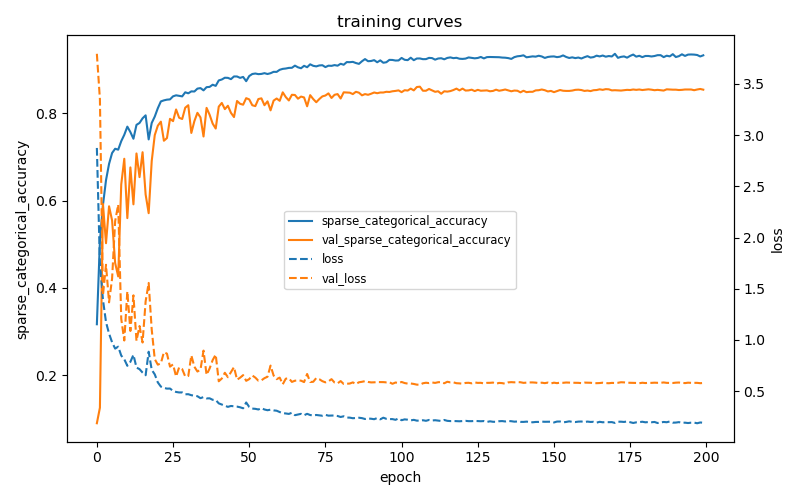
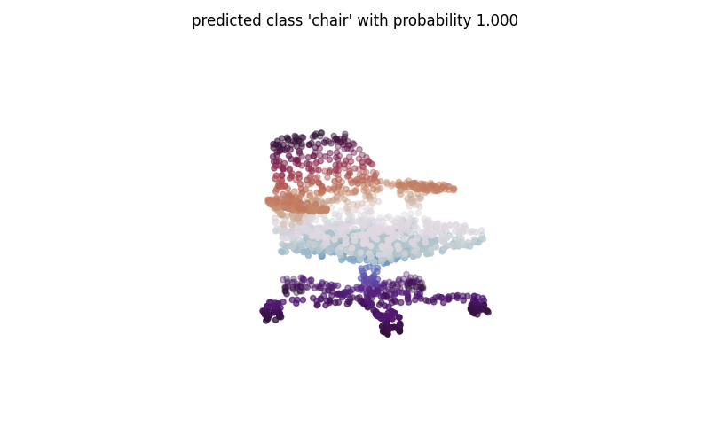

# PointNet implementation using Keras 3

This is a (yet another) custom implementation of the well-known PointNet model for pointcloud classification. This has been coded with the objective to keep things as simple as possible, limiting the use of third-party libraries and making the most of the Keras API (theoretically "backend-agnostic").

## Getting started

### Dependencies

The code has mainly been developed and tested with `python` 3.9, `numpy` 1.26, and `keras` 3.3 with `tensorflow` 2.16 as backend.

Dependencies have been installed via conda with

    conda install tensorflow-gpu -c conda-forge

although Tensorflow 2 is preferably installed using pip with

    pip install --upgrade pip
    pip install tensorflow

Both commands also install Keras and Numpy at the same time.

Thanks to Keras this code also works with other supported backends, i.e. PyTorch and JAX. It has been sucessfully tested with `torch` 2.3.

### Training

PointNet is often trained on the ModelNet40 dataset, which has also been chosen here. An already trained model is included in `models/saved` folder (see below for usage). An **accuracy of about 85 %** (slightly lower than the original implementation) has been obtained on the test set (see below for details about ModelNet40).

  

  
Training on ModelNet40

The `train_model.py` file may be re-used for futher experimentations (see below for data preparation).

In detail, the use of a custom training loop has been avoided. The *learning rate* and *batch normalization momentum* are updated during training (in accordance with the original paper/implementation) by relying on Callbacks (`keras.callbacks.Callback`). The training data are augmented "on the fly" (also in accordance with the original paper/implementation) by implementing a custom data generator (`keras.utils.PyDataset`).

### Predicting

The `predict_example.py` file provides a minimal example for prediction.

  

  
Example of prediction

In detail, using the Keras API allows to save and load models (configuration, weights, etc.) quite easily. 

### Data preparation

Data often have to be preprocessed before training, which is the case for the ModelNet40 dataset. The `modelnet40.py` in the `data` folder contains all the preprocessing steps carried here. Just download the ModelNet40 dataset (put it in `data/ModelNet40` by default) and run the file. This will create a HDF5 file and save it in `data/ModelNet40_preprocessed`.

In detail, a pointcloud (consisting of *n* points, optionally with normals) is sampled from the faces of each mesh contained in the ModelNet40 dataset. Pointclouds are normalized into a unit sphere. A data augmentation step is performed during training (randomly rotating along the up axis, jittering the position of each point by gaussian noise and shuffling the points).

## About

### PointNet

The PointNet classification network (the upper part of the figure shown below) takes a pointcloud of *n* points as input and outputs a classification score for *m* classes. 

  

  
PointNet architecture

See the [PointNet project page](https://stanford.edu/~rqi/pointnet/) for more details about Pointnet.

### ModelNet40

ModelNet40 consists of 12,311 CAD-generated meshes distributed over 40 categories/classes (of "common" objects such as airplane, car, plant, lamp, etc.). A large portion of these meshes (9,843 to be exact) is used for training and a smaller portion (2,468 to be exact) is reserved for testing.

See the [ModelNet project page](https://modelnet.cs.princeton.edu/) for more details about ModelNet40 and access to the data.

## Aknowledgement

This work was greatly inspired by previous PointNet implementations, such as:
* [The orginal one](https://github.com/charlesq34/pointnet) by Charles R. Qi et al. (using Python 2.7 & TensorFlow 1.0)
* [This one](https://github.com/luis-gonzales/pointnet_own) by Luis R. Gonzales (using Python 3.x & TensorFlow 2.0)
* [This one](https://www.tensorflow.org/graphics/api_docs/python/tfg/nn/layer/pointnet) (partial) found in the TensorFlow Graphics module

In addition to the Tensorflow/Keras official online documentation, the book *Hands-On Machine Learning with Scikit-Learn, Keras, and TensorFlow: Concepts, Tools, and Techniques to Build Intelligent Systems (2nd Edition)* by Aurélien Géron was of a great help and another major source of inspiration.
